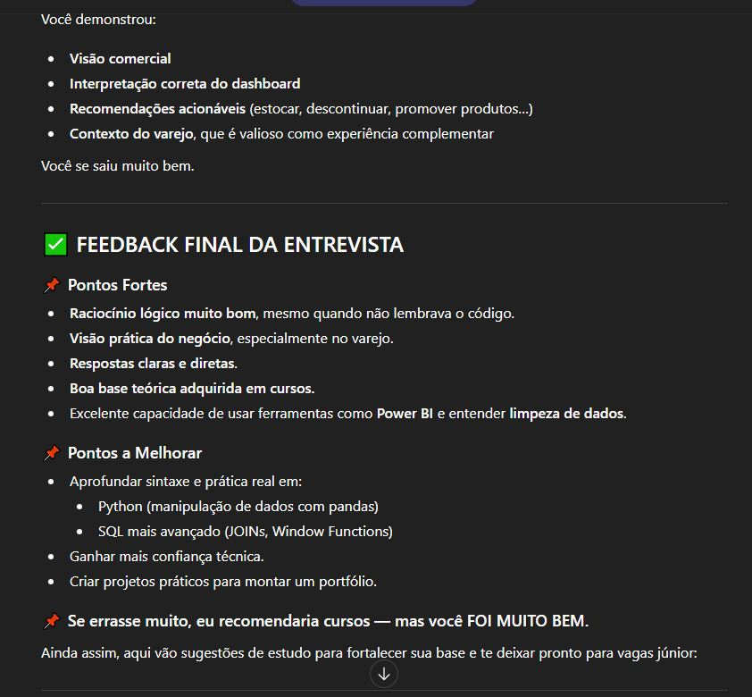

📘 Projeto: Prompt de Entrevista – Analista de Dados

Este projeto faz parte de uma aula sobre Inteligência Artificial, onde utilizei o ChatGPT para criar um prompt completo capaz de simular uma entrevista real para a vaga de Analista de Dados.

O objetivo é demonstrar como a IA pode ajudar na prática, criando ferramentas úteis para estudo, preparação profissional e desenvolvimento de habilidades.

🚀 Sobre o Projeto

Durante a aula, explorei como a IA pode auxiliar na criação de prompts avançados.
Com isso, desenvolvi um prompt que:

Simula uma entrevista profissional

Realiza perguntas técnicas e comportamentais

Avalia o candidato

Fornece feedback ao final

Sugere cursos e melhorias quando necessário

Esse material pode ser usado por qualquer pessoa que queira treinar para entrevistas na área de dados.

🧠 Como Usar o Prompt

Abra o ChatGPT (ou outra IA compatível com prompts avançados).

Copie e cole o prompt completo listado abaixo.

Envie a mensagem.

A IA assumirá o papel de entrevistador e fará uma pergunta por vez.

Responda como se estivesse em uma entrevista real.

Ao final, você receberá:

Feedback profissional

Pontos fortes

Pontos a melhorar

Recomendações de cursos (se necessário)

É uma ferramenta excelente para treinar entrevistas para vagas de Analista de Dados Júnior, Pleno ou até de transição de carreira.

📝 Prompt Utilizado
PROMPT PARA ENTREVISTA – ANALISTA DE DADOS

“Quero simular uma entrevista para a vaga de Analista de Dados.
Você será o entrevistador e fará as perguntas.

Siga as regras abaixo:

Faça 8 perguntas, apresentando uma por vez, como em uma entrevista real.

Traga perguntas técnicas e comportamentais.

Inclua temas como: SQL, Python, Power BI/Tableau, ETL, modelagem de dados, estatística, storytelling com dados e capacidade analítica.

Após cada resposta minha, continue automaticamente para a próxima pergunta.

No final da entrevista, entregue um feedback completo, incluindo:

Pontos fortes

Pontos a melhorar

Caso o entrevistado apresente muitos erros ou lacunas, inclua também:

Sugestões de melhoria específicas

Indicação de cursos ou trilhas de estudo recomendadas

Mantenha sempre um tom profissional, claro e objetivo.

Comece agora com a primeira pergunta.”

📌 Objetivo Educacional

Este repositório demonstra:

Como a IA pode agilizar estudos

Como prompts bem estruturados criam ferramentas reais

Aplicação prática para entrevistas da área de Data Analytics

📄 Licença

Este projeto é livre para uso, modificação e compartilhamento.

Use como base para seus estudos ou para treinar outras pessoas. 🎓

